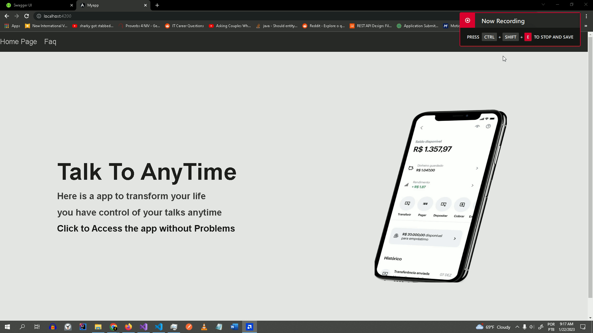
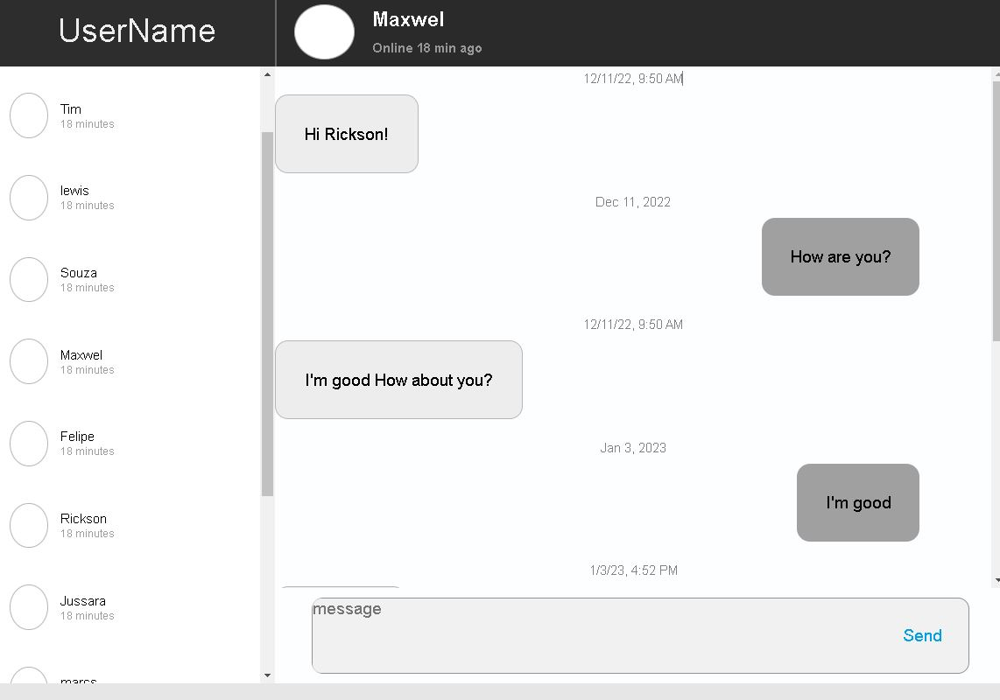
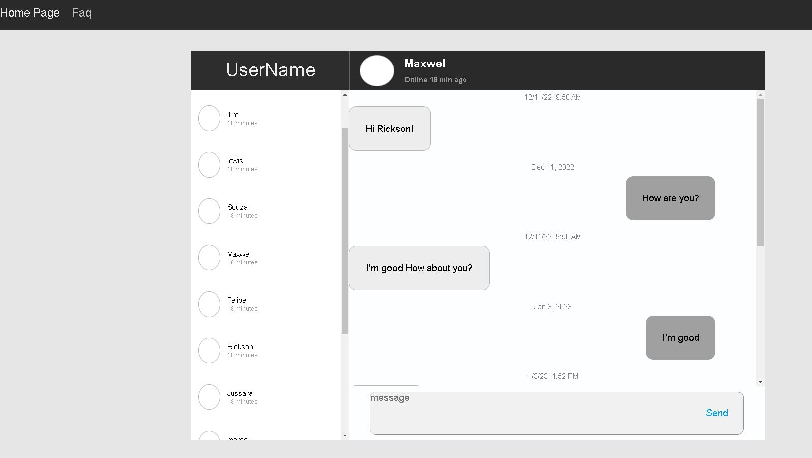
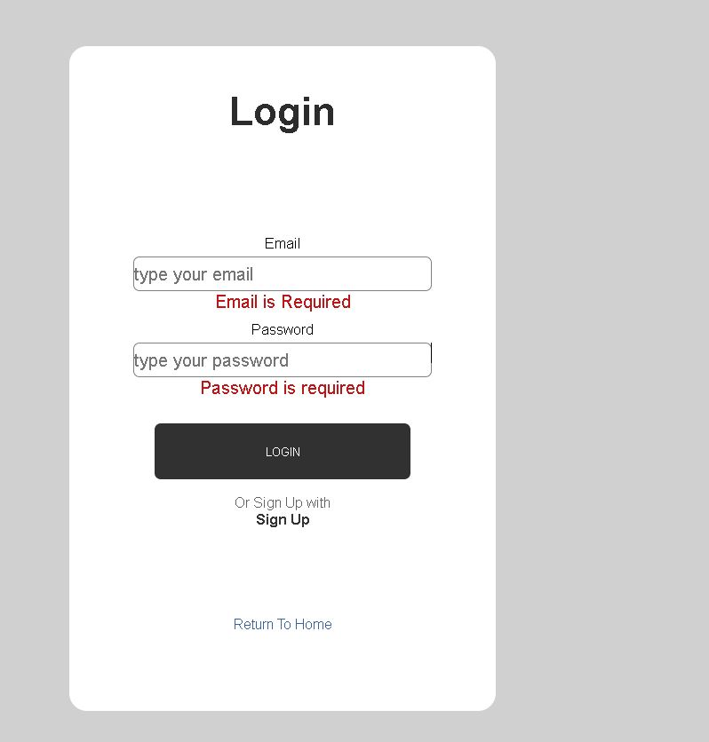
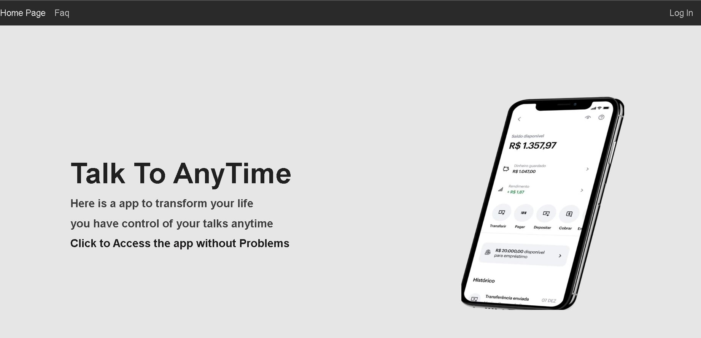
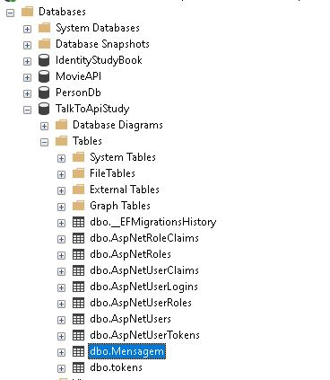
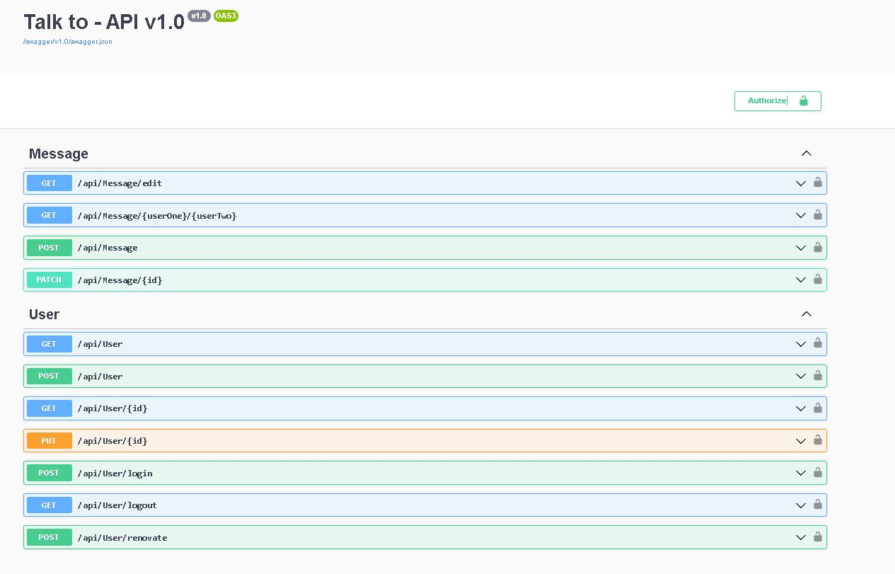
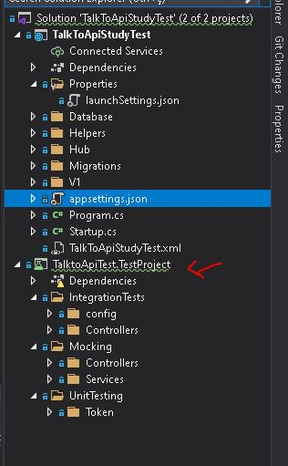
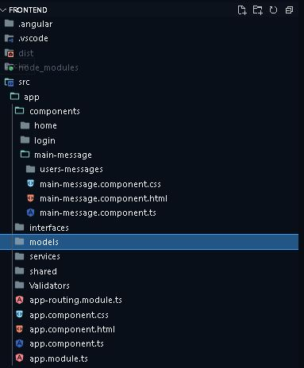

# C# WEB API AND ANGULAR - REAL-TIME CHAT MESSAGE API

 
## 🚀 Tech Used 
 

- c# Web API 
- Microsoft SQL Server  
- HTML and CSS typescript 
- Angular 2 
-   SignalR WebSocket 
-   Unit testing, mocking and Integration Tests
-   Nunit  
-   Swagger  
-   Linq ORM  
-   Authorization Identity  
-   Authentication Token JWT   

 

## 🖼 Screenshot APPLICATION SCREENS  

Whole application

 
 

Chat-zoom-page

 
 

chat-screen-page

 
 

Login Page

 
 

home Page

 
 

DATABASE

 
 

Swagger

 
 

backend-page

 
 

Frontend

 
 

## Linkedin Below - Linkedin ABaixo

<h4 align="center">
   Created by   <a href="https://www.linkedin.com/in/luiz-carlos-b50693173/" target="_blank"> Luiz Carlos </a>
</h4>

</html>
